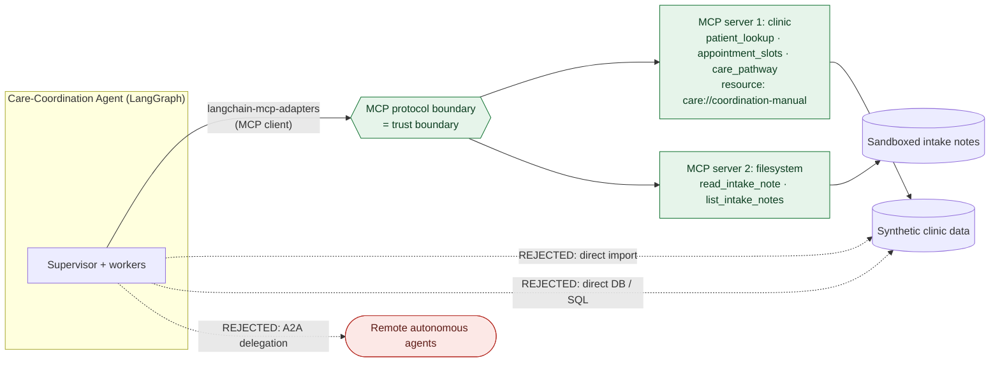

# Integration Decision — MCP vs API vs Direct-DB vs A2A

**Covers:** MCP & Interoperability rubric parameter "Integration decision (3)".
**Decision:** Expose the clinic's operational capabilities through a **custom MCP server (stdio)**,
consumed by the agent via **langchain-mcp-adapters**. A second MCP server (filesystem) is added as a
good-to-have to demonstrate multi-server interoperability.

---

## The options considered

| Option | What it is | Pros | Cons | Fit here |
|--------|-----------|------|------|----------|
| **MCP server (chosen)** | Tools/resources exposed over the Model Context Protocol; agent connects via adapters. | Standard, model-portable contract; tools + resources + prompts in one protocol; hot-swappable servers; matches the "interoperability" learning goal; discoverable tool schemas. | Extra process + protocol overhead; stdio plumbing. | **Primary.** Directly satisfies AC-09/AC-10 and the interoperability track. |
| Direct Python API calls | Import clinic functions directly into the agent. | Simplest, lowest latency. | Tight coupling; no standard contract; not interoperable across languages/teams; doesn't demonstrate MCP. | Rejected as primary — used only for pure local heuristics that aren't "clinic systems". |
| Direct DB access | Agent queries a DB directly. | No service layer. | Leaks schema into the agent; no access control/validation boundary; **No-external-DB rule**; unsafe for untrusted input. | Rejected. |
| A2A (agent-to-agent) | Delegate to remote autonomous agents over an agent protocol. | Great for cross-org autonomous collaboration. | Overkill for calling deterministic clinic tools; heavier; our "systems" are tools, not agents. | Rejected as primary (noted as a possible extension). |

## Architecture diagram — chosen MCP design vs. the alternatives

The chosen design (solid path) routes every "clinic system" call through the MCP protocol boundary;
the rejected alternatives (dashed) would have the agent reach systems directly or delegate to remote
agents.



Plain-text rendering of the same design (in case the Mermaid diagram does not render):

```
                         ┌──────────────────────────────────────────────┐
  Agent (LangGraph)      │ CHOSEN                                         │
  supervisor + workers   │   agent ──(MCP client / adapters)──▶ MCP       │
        │                │            protocol boundary (trust boundary)  │
        │                │              ├─▶ server 1: clinic tools+resource│
        │                │              └─▶ server 2: filesystem tools     │
        │                └──────────────────────────────────────────────┘
        │  ┈┈▶ direct Python import        (REJECTED — tight coupling)
        │  ┈┈▶ direct DB / SQL access      (REJECTED — no boundary, No-DB rule)
        └  ┈┈▶ A2A delegation to remote agents (REJECTED — see §"Why not A2A")
```

## Why MCP wins for this workflow

- The clinic capabilities (patient directory, appointment calendar, care-pathway manual) are exactly
  **tools + a resource** — MCP's native model. `care_coordination_manual` fits MCP **resources**;
  `patient_lookup` / `appointment_slots` / `care_pathway` fit MCP **tools**.
- MCP gives a **typed, discoverable, model-portable** contract, so the grader's Gemini-based agent (or
  any MCP client) can consume the same server unchanged.
- Servers are **hot-swappable and isolated** — we run the clinic server and a filesystem server side by
  side through one adapter client, demonstrating true interoperability.
- The protocol boundary is a natural **trust boundary** for untrusted patient input (defense in depth
  with the quarantine layer).

## Why not A2A (agent-to-agent)?

A2A protocols (e.g. Google's Agent-to-Agent, or agent "handoff" over an agent card/registry) let one
autonomous agent **delegate a task to another autonomous agent** across a trust boundary, negotiating
capabilities at run time. It is the right tool when the thing on the other side is *itself an agent*
that reasons and plans.

It is **not** the right tool here, for four concrete reasons:

- **Our "systems" are tools, not agents.** The patient directory, appointment calendar, and
  care-pathway manual are deterministic capabilities with fixed schemas. Modeling them as autonomous
  agents adds negotiation, planning, and non-determinism we explicitly *do not want* on a safety path.
- **Determinism + auditability.** The urgency policy must be deterministic and centrally enforced by
  our supervisor (AC-03). Delegating to a remote agent would move part of that decision off-box and
  make it far harder to trace and reproduce for a grader.
- **Weight & scope.** A2A brings agent discovery, capability cards, and cross-org identity/consent —
  overhead with no payoff when both ends are inside one synthetic clinic app.
- **Interoperability goal is already met by MCP.** The learning objective is a *standard, portable
  tool contract*; MCP delivers that for tools + resources without the agent-negotiation surface.

**Where A2A would fit as a future extension:** if the clinic later needed to hand a case to an
*external, independently-operated* triage or specialist agent (a different organization's system that
plans on its own), A2A would be the appropriate boundary — the remote party is then a peer agent, not
a tool. That is the dashed `A2A delegation` path in the diagram above, noted as an extension rather
than part of this deliverable.

## What we expose (AC-09)

**Server 1 — `clinic` (`src/mcp/server.py`):**
- Tool `patient_lookup(patient_id)` → synthetic patient record.
- Tool `appointment_slots(specialty, urgency)` → available synthetic slots.
- Tool `care_pathway(condition)` → structured pathway steps.
- Resource `care://coordination-manual` → the care-coordination manual text.

**Server 2 — `filesystem` (`src/mcp/server2_filesystem.py`, good-to-have):**
- Tool `read_intake_note(path)` / `list_intake_notes()` over a sandboxed synthetic notes dir.

## Consumption (AC-10)

`src/mcp/client.py` uses `langchain-mcp-adapters` `MultiServerMCPClient` to load both servers' tools as
LangChain tools and hand them to the agent. A committed transcript
([`evidence/mcp_toolcall_transcript.json`](../evidence/mcp_toolcall_transcript.json)) shows the agent
invoking an MCP tool with arguments and receiving a result.
